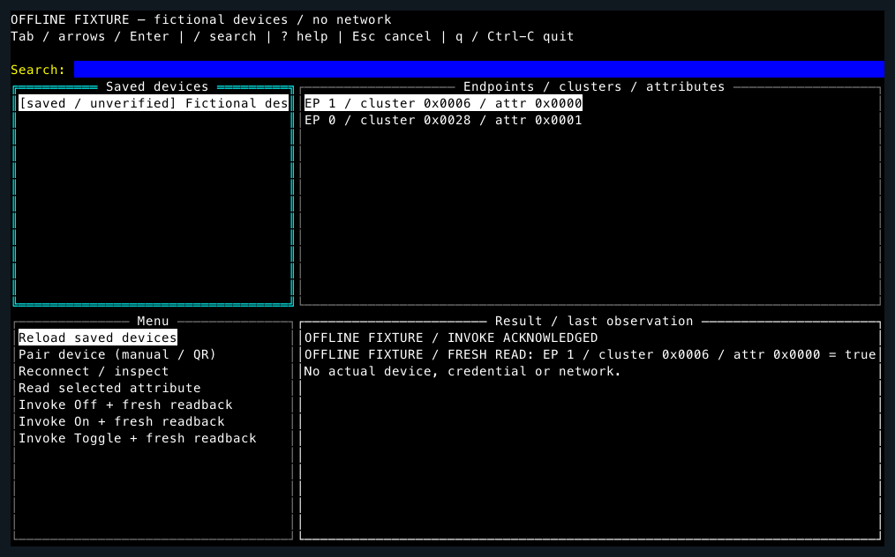

# matterctl full-screen controller (initial draft)

This first stage adds `matterctl tui`, with tview/tcell code confined to
`cmd/matterctl/internal/tui`. Existing CLI commands remain available. The only
library changes preserve caller cancellation through commissioning and remove
an onboarding payload from the no-matching-device error.

## Start

Use Go 1.25+ and a real terminal:

```sh
make tui
# Equivalent, explicitly fictional and offline:
GOWORK=off go run ./cmd/matterctl tui
GOWORK=off go run ./cmd/matterctl tui --help
```

The default uses fictional lights in memory. It creates no fabric, writes no
credentials, starts no BLE/mDNS transport and performs no device operations.
The pairing form still validates public test payloads and exercises a fixture
success/failure flow. Fixture state is discarded on exit.

For later use with an **existing go-matter commissioner fabric**, opt in:

```sh
GOWORK=off go run ./cmd/matterctl tui --live
# Or select an existing compatible store:
GOWORK=off go run ./cmd/matterctl tui --live --store-dir /path/to/existing/store
```

The default live store is `~/.matterctl`,
matching the CLI. The directory must already exist. Opening a file store can
recover its existing journal; use only one process per store. Opening the UI
lists local records without calling `Commissioner.Start`. The first confirmed
network operation starts the commissioner. Neither OS permissions nor existing
key permissions are changed. Transport permission failures are shown without
printing underlying logs. No live mode was exercised for this work.



[Pairing form](images/tui-pair.png) · [Compact layout](images/tui-compact.png).
Screenshots are actual tcell simulation-screen cell output rasterized with a
monospace font, using fictional values and an empty masked pairing field.

## Keys and menus

| Key | Action |
| --- | --- |
| Tab / Shift-Tab | Devices → Paths → Menu → Result |
| Up / Down / Enter | Select a device/path/menu item; Enter on device/path focuses Menu |
| `/` | Search saved name or hexadecimal node ID; Enter returns to Devices |
| Esc | Clear search, cancel a form, or request in-flight operation cancellation |
| `?` | Show key help |
| `q` / Ctrl-C | Cancel pending work and restore terminal (q remains text in input fields) |

Pairing input accepts a manual 11/21 digit code (spaces/hyphens allowed), or an
`MT:` QR **text payload**, using the existing parsers. There is no camera/QR image
reader. Existing QR decoding supports the mandatory 11-byte payload only; optional
QR data is not supported. Only version 0 standard commissioning flow is accepted;
reserved setup PINs are rejected. Errors do not echo input. The field is masked
and cleared after validation. Tab/Shift-Tab moves through form fields/buttons;
Cancel is initially focused. Validation precedes a separate confirmation.

Every read, inspect, invoke and pairing operation needs confirmation. Pairing
adds persistent access to a device; invoke changes device state. There is no
reset/unpair/factory-reset or batch action. Reload reads only local records.
Selection/search is locked during work to keep a response attached to the selected
node. Work runs outside the UI goroutine. A working indicator represents the whole
exchange: the public API does not expose per-stage progress. Read/inspect/invoke
have a 30-second deadline; pairing has 120 seconds. Esc requests cancellation and
waits for transport completion. Exit cancels work, restores the screen, then waits
up to five seconds for shutdown; an unfinished shutdown is reported as uncertain.
There is no automatic retry.

At fewer than 95 columns the panels stack. Forms and selections survive resizing;
60×24 minimum and 110×32 recommended. Smaller terminals remain cancellable but
can clip labels. Arrow keys scroll lists/results. Mouse is disabled.

## Implemented scope

- Local saved-device list, searchable by name/ID. `saved / unverified` is not a
  connectivity claim. Results describe the last operation; the CASE session is
  closed after each operation. There is no continuously monitored connected state.
- Reconnect / inspect: fresh CASE, Descriptor root PartsList, each endpoint's
  ServerList, and AttributeList/AcceptedCommandList global attributes. Unknown
  clusters/attributes are listed by numeric IDs. Missing lists are marked, not
  invented. Invoke is offered only for advertised On/Off Off/On/Toggle commands
  associated with an advertised OnOff attribute.
- Read: OnOff attribute 0x0000 of cluster 0x0006; Basic Information cluster 0x0028
  attributes VendorName (1), VendorID (2), ProductName (4), ProductID (5),
  HardwareVersion (8), HardwareVersionString (9). Other attributes have no TUI
  read action in this stage. No arbitrary security/key-bearing attribute display.
- On/Off invoke: acknowledged response and a subsequent fresh OnOff read are
  separately labelled. Failed readback means value unknown, even after a successful
  command. A failed or canceled invoke can have changed state: read before retrying
  Toggle. No generic write/raw invoke, timed commands, subscriptions or other
  cluster controls are implemented in the initial TUI. The existing CLI retains
  its numeric read/write/invoke functionality.
- Pairing: the existing commissioner PASE → attestation → AddNOC → CASE flow with
  an existing complete fabric. The TUI does not create a new fabric identity,
  generate real credentials, provision Wi-Fi/Thread, or choose a requested node
  ID. The library assigns the actual node ID. Devices must already have an
  operational IP network path; BLE may be used for the commissioning exchange,
  subject to the library and OS support. Unsupported transport/cluster failures
  remain failures. Library attestation limitations still apply.

## Persistence, cancellation and duplicates

The backend supplies the same `matter/store.Store` to the commissioner and the
UI. Existing fabric configuration is loaded by Start; successful commissioning
saves the fabric and commissionee record. A tracking wrapper detects write errors
which the library otherwise logs without failing Commission. The UI verifies a
saved record and distinguishes **joined / saved** from **joined / local save
failed**. Never interpret the latter as an uncommissioned device. Restart access
is only expected if both fabric and node data were saved and remain valid.

Individual file writes are atomic; the commissioner does not atomically commit
fabric + node records together. There is no remote rollback API in this flow.
Canceled/failed commissioning may have crossed AddNOC or CommissioningComplete;
the UI cannot promise that the device's fail-safe will revert it. It does not
delete old records, roll back device access or retry automatically. Protocol
failures before success do not initiate new local saves in the TUI. A partial
save needs deliberate recovery using the existing store/device administrator.

Store identity is compressedFabricID + nodeID: saving the same identity replaces
one record. A manual code does not identify a physical device uniquely, so the
TUI cannot reliably pre-detect commissioning the same physical device twice.
Stores containing the same node ID under different fabric identities are refused
to avoid routing an operation to an ambiguous selection.
The offline fixture rejects its duplicate pairing; this is not a live-device
identity guarantee. Existing store tests cover atomic writes, rollback, journal
recovery and file modes, and TUI tests cover save failure and restart listing.

Pairing/PIN/key material never enters TUI logs or screenshots. Library logging
is disabled for the entire TUI entry, including live operations, and raw errors
from commissioning/storage are not displayed. The earlier CLI's verbose pairing
logging behavior is outside this change; do not use it to capture real codes.
The store contains plaintext private keys under the library's restrictive modes;
this draft performs no chmod, migration, OS permission grants or credential export.

## Apple Home and multi-admin

An Apple Home registration is on Apple's fabric. This controller cannot reuse
Apple Home's keys or automatically operate its devices. A device already paired
elsewhere must support multi-admin and have its commissioning window opened by
an existing administrator. Follow that ecosystem/device's pairing-mode flow and
use its newly supplied commissioning code, not an assumption that the original
printed code remains active. Network reachability and device fabric capacity are
also required. Apple documents the pairing-mode procedure in
[Pair and manage your Matter accessories](https://support.apple.com/en-us/102135).
This TUI does not open another ecosystem's commissioning window or remove its
fabric. No Apple Home device was discovered, paired or operated for this work.

## Verification and remaining work

```sh
make check-tui
```

Checks use fictional backends, synthetic non-key byte fixtures and in-memory
protocol tests. They cover masked forms, invalid code/checksum, manual/QR parsing,
confirmation cancellation, Tab/search/resize, async cancel/timeout, screen exit,
command allowlisting, acknowledgement versus readback failure, persistence failure,
identity replacement/restart listing, commissioning context cancellation, and
existing CLI parser/cluster-command regressions. The darwin/arm64 binary is built on macOS with CGO/CoreBluetooth; linux/arm64
is cross-built with CGO disabled. Linux CI runs TUI checks in a fresh network
namespace; macOS uses only the same offline fixture tests. TUI checks never start BLE/mDNS, household LAN discovery,
advertisements, physical pairing, or real credential creation.

Full repository integration and chip-tool jobs continue to run in their existing
CI runner environment. Do not run `make test` on a household network for this TUI
check: other packages contain network/BLE integration tests. New-fabric bootstrap,
Wi-Fi/Thread forms, more cluster controls, stage-level progress, full commissioning
rollback/atomic persistence, concurrent store locking and physical-device testing
remain follow-up work. This is a reviewable initial controller, not a tested
replacement for a certified controller.

UI dependencies: tview v0.42.0 (MIT), tcell v2.8.1 (Apache-2.0). See
[third-party notices](tui-third-party-notices.md). Navigation follows the public
[uecho-simulator controller](https://github.com/cybergarage/uecho-simulator/blob/main/README.md);
no simulator code or assets were copied.
